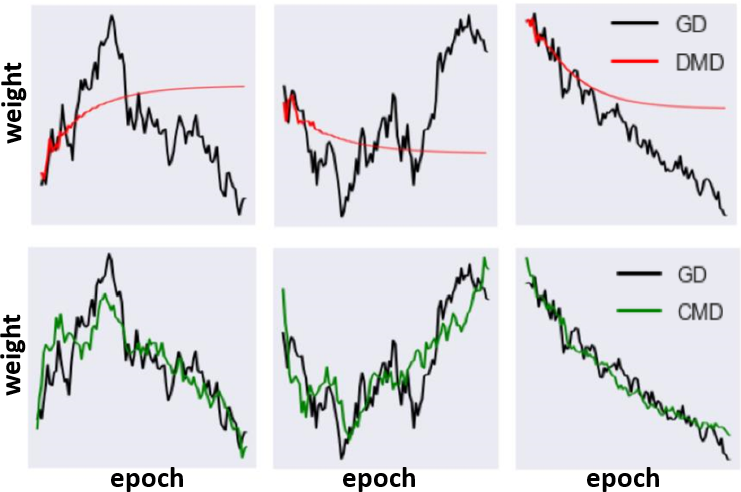
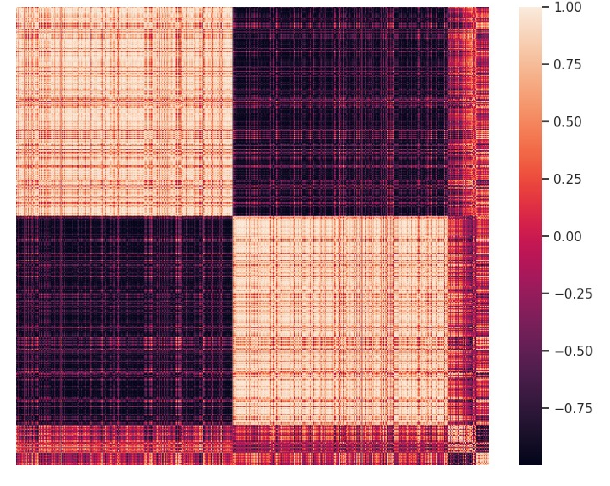
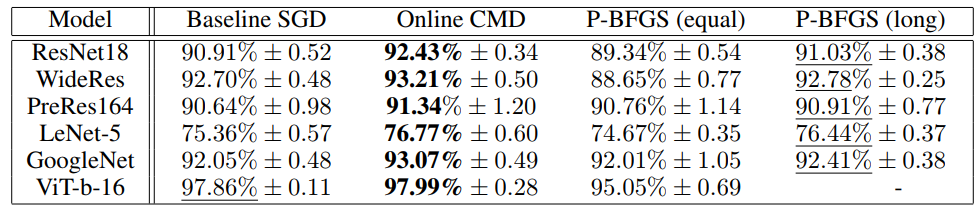
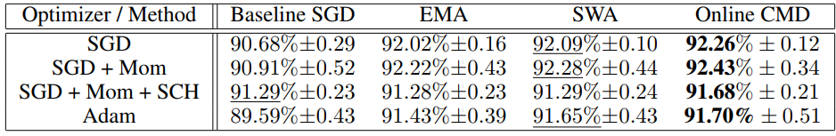
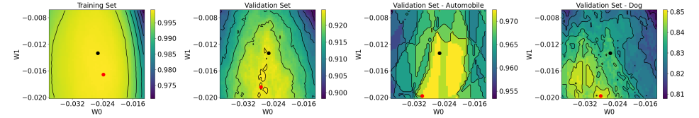

# **Correlation Mode Decomposition (CMD)**

This repository is the official implementation of:  
['Enhancing Neural Training via a Correlated Dynamics Model' (ICLR 2024)](https://iclr.cc/virtual/2024/poster/18304)  
  
CMD is a correlation-based training dynamics modeling method which divides the full NN trainable parameters to several clusters. Our method leverages correlations in weight updates to enhance overall model performance in any scenario and convergence speed in the federated learning setting. We demonstrate the effectiveness of CMD across various neural architectures, tasks and datasets and compare it with other regularization and dimensionality reduction methods.  
   
 


## **Requirements:**
- Python 3.8.8
- pytorch 1.13.1
- CUDA Version 11.6.112

Additional python library:
- ordered_set


# **Usage**:

1) The default example is executed as followed:
```sh
python train_cmd.py
```

Default example details:
 - ResNet18 on CIFAR10 (SGD optimizer, learning rate - 0.05, momentum - 0.9, 150 epochs, no scheduler)
 - 3 training versions are compared - SGD, Post-hoc CMD, Online CMD. See paper for details on their roles and differences.
 - CMD is performed with 10 modes (M), 1000 sampled weights (K) and 20 warm-up epochs (F).
 The number of modes and sampled weights are hard-coded per model type, warm-up epochs are given as an argument.
 
2) Add P-BFGS to the compared methods:
```sh
python train_cmd.py --p_bfgs True
```
Default is P-BFGS with 80 warm-up epochs and 40 dimensions.

3) Remove one of the 4 methods (example on Post-hoc CMD):
```sh
python train_cmd.py --cmd_PostHoc ''
```

4) Example of comparing only Online CMD to P-BFGS:
```sh
python train_cmd.py --p_bfgs True --sgd '' --cmd_PostHoc ''
```

Training parameters (optimizer type, scheduler type, number of epochs, learning rate, momentum, number of CMD modes, etc.) are hard coded and different per model type. To access these parameters see the function get_model() in base_utils.py in the utils directory. These parameters follow the parameters used in the results section in the paper.
Additional options and details are avialable within the code (bottom of the main file - train_cmd.py).


# **Results**
- Results on different classification models, trained and tested on CIFAR10:  
  

- ResNet18 on CIFAR10 using different regularization methods:  


- Visualization examples using CMD:
    


# **Citation**
If you find our work useful in your research please consider citing our publication:

```sh
@inproceedings{
brokman2024enhancing,
title={Enhancing Neural Training via a Correlated Dynamics Model},
author={Jonathan Brokman and Roy Betser and Rotem Turjeman and Tom Berkov and Ido Cohen and Guy Gilboa},
booktitle={The Twelfth International Conference on Learning Representations},
year={2024},
url={https://openreview.net/forum?id=c9xsaASm9L}
}
```
